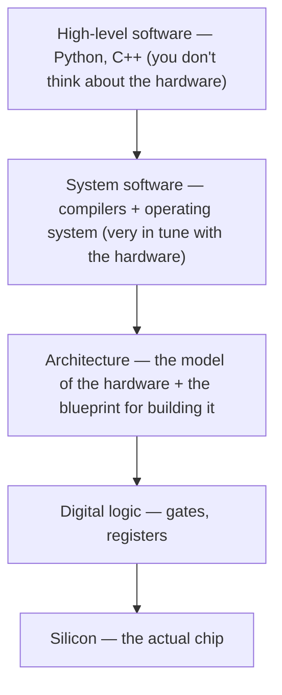
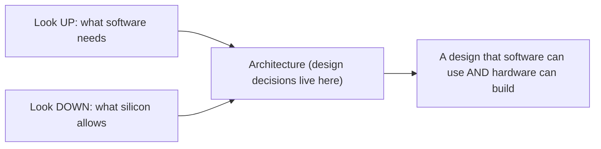
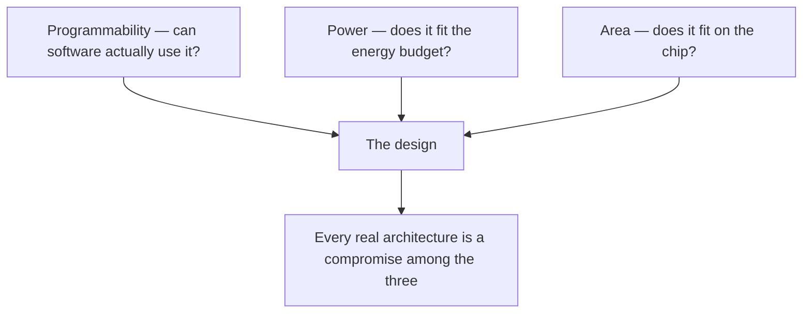
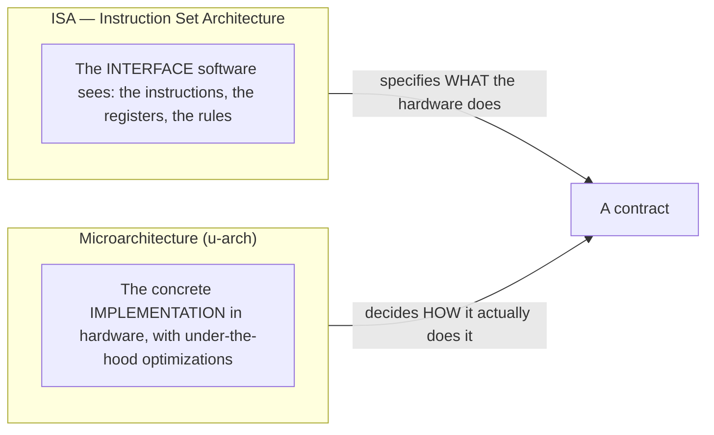
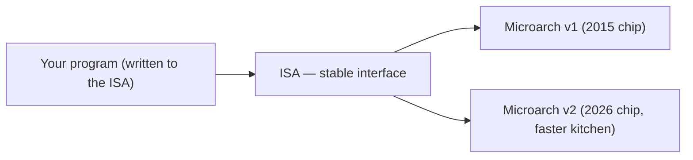
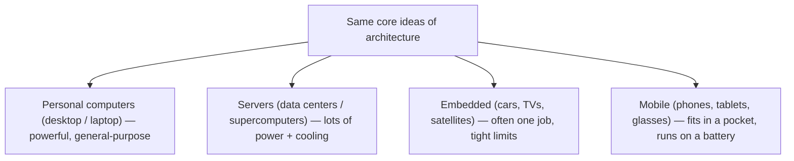
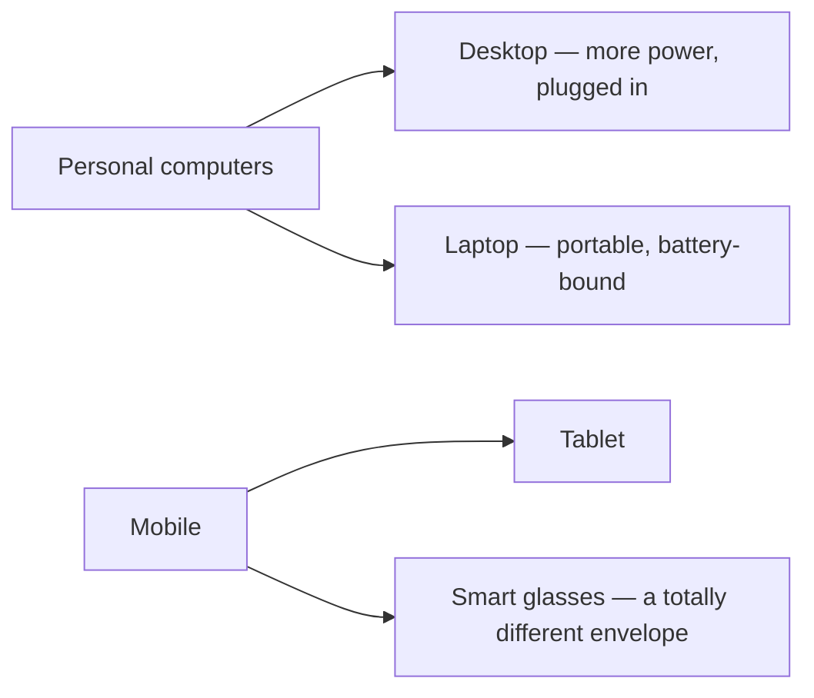

# How Computers Work — ELI5 field notes

Learning the machine from the ground up, in public. Short, diagram-heavy explainers of the ideas underneath everything I build *with* AI — because you reason better about latency, cost, and systems when you know what's happening below the API.

## Notes in this series

- **Note 01 — What is Computer Architecture?** (below) — the abstraction stack, ISA vs microarchitecture, and why the same chip idea looks different in a phone and a data center.
- **[Note 02 — How do computers read code?](how-code-runs.md)** — how source code becomes machine instructions: the compiler pipeline, jumps and flags, the call stack, interpreters and bytecode, and why one binary doesn't run everywhere.

**Related repos:** [Inference Engineering (how LLM serving works) →](https://github.com/wilsonwu-ai/inference-engineering) · [AI Engineer roadmap →](https://github.com/wilsonwu-ai/ai-engineer-roadmap)

---

## Note 01 — What is Computer Architecture?

> Prompted by **Nick's "Bits of Architecture"** series ([video 1](https://www.youtube.com/watch?v=Q6FpHbRUdgg&list=PLxNPSjHT5qvti3DKL_ytbkNdWEcIFb4ku)). I pulled the transcript, then wrote this explanation and the diagrams in my own words. Corrections welcome.

"Computer architecture" sounds like it should mean *the circuits*. It doesn't. **Architecture is how we describe the operation and organization of a computer's hardware — at a high level.** Not gates and transistors, but the big structures: caches, registers, reorder buffers, and above all the **instructions** the machine understands. It's the layer where we decide *what the hardware does and how software talks to it*.

The cleanest way to see it: architecture is **one layer of abstraction in a tall stack**, and it sits right in the **middle**.

### The abstraction stack — and why architecture is in the middle

Each layer leans on the one below and serves the one above. You write Python without thinking about voltages; the compiler (system software) turns it into instructions; **architecture defines what those instructions are**; and below that, logic and silicon actually implement them. Architecture is the hinge in the middle — which is exactly why it has to look **both up and down.**

- **Look up (software):** we build computers to *run software*, so the workload shapes the design. An architecture for a **machine-learning** workload makes very different choices than one for **high-frequency trading**. And the hardware has to be *programmable* — if compilers and tools can't target it, no one adopts it.
- **Look down (silicon):** someone has to *build* it, under real limits — a fixed chip **area** and a **power** budget. Those constraints push back on every idea.

### The three forces every design balances

Architecture is the art of trading off three things at once:

More programmable, lower power, smaller area — you rarely get all three; you *choose*. That's the whole job. (Heads-up on terminology: chip designers usually say **PPA — power, performance, area**. This note follows the source video's "programmability/power/area" framing; treat *programmability* here as the flexibility-side cousin of *performance* — either way, power and area are what you trade against.)

---

### The big split: ISA vs microarchitecture

Architecture breaks into **two halves**, and confusing them is the classic beginner mistake:

- **ISA (Instruction Set Architecture)** — the **contract with software**: the exact set of instructions the processor understands, plus its registers and how it behaves. Examples you can go look up: **x86, ARM, RISC-V, MIPS**.
- **Microarchitecture** — the **actual hardware design** that implements that ISA. Two chips can share an ISA but have wildly different microarchitectures: caching, pipelining, out-of-order tricks — all invisible to the programmer, who only sees the ISA.

> ELI5: the **ISA** is the *menu* (what you can order); the **microarchitecture** is the *kitchen* (how the dish actually gets made). Two restaurants with the same menu can run totally different kitchens.

That separation is the reason your old software still runs on a new CPU: same ISA (menu), better microarchitecture (kitchen).

---

### The "computer" part: one idea, many machines

Architecture isn't one-size-fits-all, because we build for very different **classes of computers**, each with its own priorities:

A server lives in a warehouse with abundant power and cooling; a phone fits in your pocket and sips a battery — so their designs diverge hard. And it doesn't stop at the category line: **even within one class**, the decisions keep splitting.

Desktop vs laptop, tablet vs smart glasses, a broad server vs a specialized supercomputer node — each pair is the *same discipline* making *different bets* about programmability, power, and area.

---

## Why this matters if you build *with* AI

I don't design chips — I build products on top of models. But this framing pays rent constantly:

- **"It's slow" almost always means a layer below the one you're looking at.** Architecture-in-the-middle is the reminder that a Python-level symptom can have a system-software or hardware cause. My [inference-engineering notes](https://github.com/wilsonwu-ai/inference-engineering) are basically this idea applied to LLMs — the API is the top layer; the cost curve lives below it.
- **The ISA/microarchitecture split is the same "interface vs implementation" line everywhere.** A stable API (the ISA) over a changing engine (the microarchitecture) is exactly why vLLM can rewrite its internals without breaking your code — and why you design your *own* systems as a stable contract over a swappable engine.
- **"Which class of computer?" is the same question as "which deployment target?"** Designing for a data-center GPU vs. an edge device vs. a laptop is the modern version of server-vs-embedded-vs-mobile — same three forces (programmability, power, area), same "choose, you can't have all three."
- **Workload shapes the machine.** An architecture for ML looks different from one for HFT — which is *why* GPUs, TPUs, and inference accelerators exist. Knowing the workload drives the hardware is what lets you pick the right instance instead of the biggest one.

---

## Credits & further reading

- **Prompt:** Nick's **"Bits of Architecture"** series — [What is Computer Architecture? (video 1)](https://www.youtube.com/watch?v=Q6FpHbRUdgg&list=PLxNPSjHT5qvti3DKL_ytbkNdWEcIFb4ku).
- **Go deeper:** Patterson & Hennessy, *Computer Organization and Design* (the classic text); the RISC-V spec is a readable modern ISA.
- **Related:** [Inference Engineering — how LLM serving works](https://github.com/wilsonwu-ai/inference-engineering).

*Field note by [Wilson Wu](https://www.linkedin.com/in/wilson1wu/) — operator learning to build with AI. ELI5 and diagrams are mine, grounded in the source video; corrections welcome. Licensed [CC BY 4.0](https://creativecommons.org/licenses/by/4.0/).*
