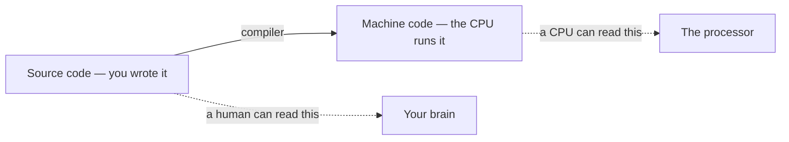
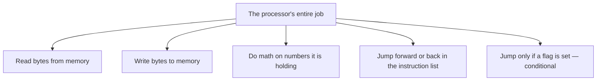
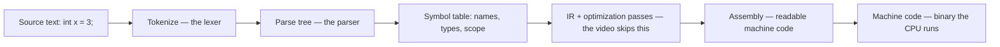
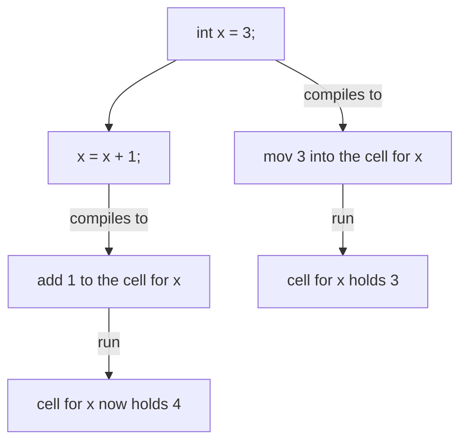
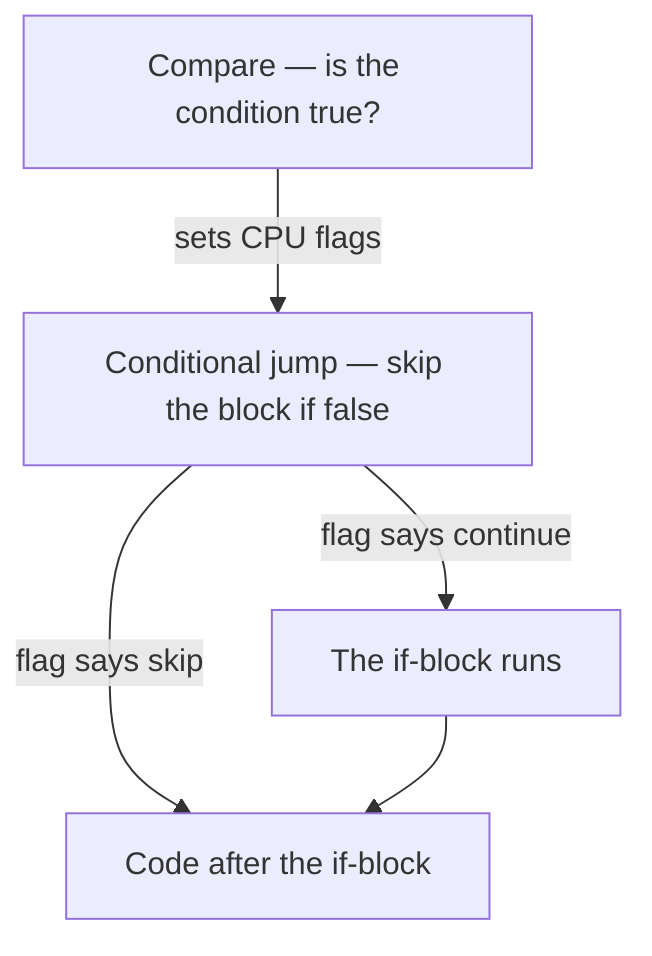
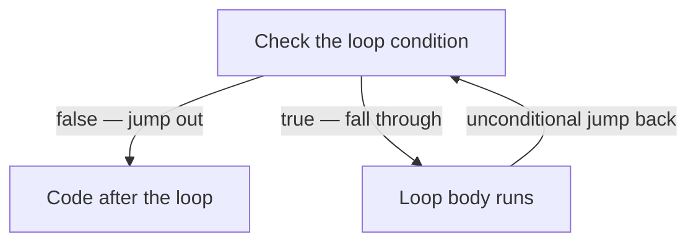
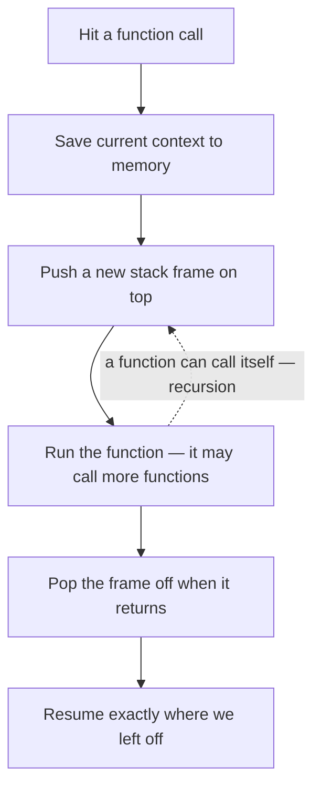
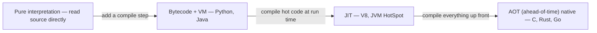
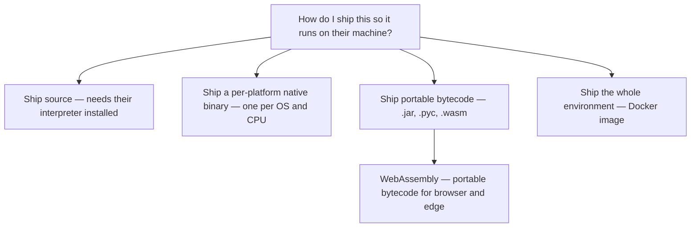

# Note 02 — How do computers read code?

> Prompted by **Frame of Essence's "How do computers read code?"** ([YouTube, 12:01](https://www.youtube.com/watch?v=QXjU9qTsYCc)). I pulled the transcript, then wrote this explanation and every diagram in my own words. Corrections welcome.

[Note 01](https://github.com/wilsonwu-ai/how-computers-work) asked *what is computer architecture?* and landed on the idea of an **ISA** — the stable list of instructions a processor promises to understand. This note is the natural sequel: you write Python or C at the top, the CPU only speaks that instruction list at the bottom, so **something in the middle has to translate**. That something is the compiler, and once you see how it works, a lot of "why is my code slow / why won't this binary run / why is Python like that" stops being mysterious.

Here's the whole trick in one line: **there are always two versions of your program.** The one you wrote, and the one the machine actually runs.

You write the left one. A program called the **compiler** produces the right one. If you only ever hit an IDE's Run button, this whole handoff was hidden from you — but it always happened.

## What a CPU is actually willing to do

Here's the humbling part. A processor, underneath all the marketing, does a tiny number of things:

That's basically it. Modern chips do more, but everything else is built on this floor. A finished executable is just **a long list of these instructions written in binary** — read here, add that, write there, jump back five lines, jump ahead but only if the compare flag is set. A program in that form is called **machine code**, and it's the only kind of program the CPU can read.

Why is the CPU so picky? ELI5 version: the chip already *contains* the circuitry for every instruction — an adder, a memory-read path, jump logic — but the wiring only gets connected when the matching instruction flows in. The ones and zeros of an instruction flip transistors open or closed, and those switches connect the right pre-built circuit for exactly that operation. (This picture is true but simplified — see the honesty box.)

You never learned programming this way, though. You learned **variables, if-statements, loops, functions**. Those are higher-level constructs invented so humans can think. A program written in that friendly form is called **source code**. The compiler's one job: turn human-readable source code into computer-readable machine code.

## The compiler pipeline

So how does a compiler turn a string of text into a list of binary instructions? It's a staged pipeline — and the shape of it will look familiar if you've ever built any data transform.

Walking `int x = 3;` through it:

1. **Tokenize.** Chop the raw characters into meaningful "words" — `int`, `x`, `=`, `3`, `;`. Before this step it's just text; the lexer figures out where the tokens are.
2. **Parse.** Organize those tokens into a hierarchical **parse tree** — the grammar and structure of the statement.
3. **Contextualize.** Record what the program is talking about in a **symbol table** — here, a variable named `x` (and the main function).
4. **Lower and generate.** Walk the tree and emit machine code that does the same thing.

That fourth step is where I want to flag the honest gap: the video jumps straight from parse tree to machine code, but real compilers almost never do. They lower through one or more **intermediate representations (IR)** and run **optimization passes** first. That skipped box in the diagram is where LLVM lives. More in the honesty box.

The binary that pops out is unreadable. Shortened to hexadecimal it's still a pain. Written as **assembly** it becomes a barely-human version of machine code — a few lines just start and end `main`, and one line for `x = 3` says *move the number 3 into a particular memory location*. Run it, and 3 lands in that cell. The compiler decided that cell is where `x` lives.

## Watch a variable become a memory cell

Add one line — increment `x` after assigning it — and recompile. Tokenize, parse, contextualize, generate. Exactly **one** new instruction appears: add 1 to the cell where `x` lives.

That's the whole secret of a variable: **it's a name the compiler assigned to a spot in memory.** Changing the variable is just changing the number stored in that spot. Assignment and simple math translate almost one-to-one into instructions.

## Control flow has no native instruction — so we fake it

Variables and arithmetic are easy because the CPU has matching operations. But **if-statements, loops, and functions have no direct machine instruction.** There's no `IF` opcode. So the compiler **emulates** them using the instructions that *do* exist — mostly jumps and flags.

**An `if`** runs a block only when a condition holds. In machine code, the block is translated normally, but in front of it the compiler puts a compare instruction (which sets CPU **flags**) followed by a **conditional jump** that leaps *past* the block — but only if we're supposed to skip it.

**An `if / else`** is the same idea plus one more jump: after the compare-and-conditional-jump in front of block one, an **unconditional jump** sits *between* the two blocks so that finishing block one skips over block two.

**A `while` loop** is jumps pointing backward. Check the condition; if false, jump out; if true, fall through and run the body; then an unconditional jump *back up* to re-check.

Once you internalize "loops and branches are just conditional jumps over a flat instruction list," assembly stops looking alien.

## Functions and the call stack

Functions are the fancy one. They package a block for reuse, isolate their own context, and — the magic part — can call other functions, or even themselves. The machinery underneath is the **call stack**: a region of memory you push onto and pop off of.

Call a function: save the current context, allocate fresh space on top of it (a **stack frame**), run the function's code — which may itself call more functions, pushing more frames — and pop back down when it returns. That "push more, pop back down" is *exactly* why recursion works and why a runaway recursion gives you a **stack overflow**: you kept pushing frames and never popped.

## Portability: why one binary doesn't run everywhere

Here's a gotcha that bites everyone eventually. Compile your program on one machine, copy the executable to another, and it may simply not run. A different **operating system**, or a different **processor model**, expects a different set of machine instructions. To run on the new box you have to compile to *that* box's machine code. So if your users span platforms, then unless you hand them the source, you're shipping **a separate executable per platform**.

Some languages dodge this. **Java** compiles not to machine code but to an intermediate form called **bytecode**. You ship the bytecode, and on each target machine a **runtime** (the JVM) runs it — interpreting the bytecode and JIT-compiling (just-in-time) the hot paths into that machine's native instructions at run time. It's a compromise — better portability, some efficiency lost — but it means one artifact runs on many processors and operating systems.

## Where did the first compiler come from?

The compiler is itself a program. So who compiled the compiler? Usually it was written and compiled *in another language* — or even in an earlier version of itself, compiling a compiler with a previous compiler. This is **bootstrapping**. Follow the chain backward far enough and you reach the origin: tiny programs written directly in machine code, hand-built to help write other programs. Automation, automating the creation of more automation.

For color: early on, "programming" could mean punching the right holes into **punch cards** — you worked out the correct holes for each instruction by hand, and you couldn't even run your deck on a different computer model, because it expected different holes. Today you type, compile, and hit run. That gift came from the people who wrote the compilers.

> ### Honesty box — where the ELI5 bends the truth
>
> - **"Bits flip transistors to connect circuitry" is a cartoon.** It's directionally true but skips instruction **decode**, the **control unit**, **microcode**, **pipelining**, and clocking — the whole microarchitecture layer. Treat it as an ELI5 model, and go to [Note 01](https://github.com/wilsonwu-ai/how-computers-work) for microarchitecture, or Crash Course CS episodes 3–8 for the gate-level depth.
> - **Parse tree → machine code is not the whole story.** The source video says so itself. Real compilers lower through one or more **intermediate representations** (e.g. LLVM IR) and run **optimization passes** before codegen. That "skipped" box is where most of a modern compiler's engineering actually lives.
> - **"Compiled vs interpreted" is not a property of a language — it's a property of an implementation.** The classic line "Python is interpreted, C is compiled" is wrong twice over: Python is *compiled* to bytecode (`.pyc`) and then interpreted by a VM; JavaScript is **JIT-compiled**; Java is *both* — compiled to bytecode, then JIT-compiled to native at run time. The same language can be interpreted here and compiled there.
> - **No invented numbers.** The source gives no benchmarks, so I'm keeping every speed claim qualitative. "Slower" means slower, not "3.7×."

## Why this matters if you build with AI

You don't write compilers to build products *with* AI. But every idea above is load-bearing under the API you call every day.

**"Compiled vs interpreted" is a spectrum, not a switch.** Think of it as a dial trading portability, startup time, and steady-state speed:

Left is maximally portable and slow to reach top speed; right is fastest in steady state and locked to a platform. Nothing is "the compiled option" — you're choosing a point on this line.

**That same portability question is a packaging decision you make on real projects.** The compiler's "ship source vs ship a per-platform binary vs ship portable bytecode" is exactly the Docker-vs-wheel-vs-WASM call:

A **Docker image** ships the whole environment so you stop caring about the target's machine code. A **Python wheel** may bundle a per-platform compiled `.so`, which is why some `pip install`s pull a prebuilt binary and others compile on the spot. **WebAssembly** is Java's bytecode idea reborn for the browser and edge — portable bytecode, JIT-compiled to native on arrival. **Cross-compiling** is you, deliberately, producing a binary for a CPU that isn't the one you're sitting at.

**This is why pure-Python hot loops feel slow — and it connects straight to inference cost.** Your Python is compiled to bytecode and run by the **CPython VM**. A tight numeric loop in that VM pays interpreter overhead on every iteration, which is exactly why the heavy math doesn't stay in Python. It **drops down to C and CUDA kernels** — small, hand-optimized compiled compute routines (a different 'kernel' than the operating-system one) — the ones inside NumPy, PyTorch, and the attention path of a serving engine. When you profile an LLM inference stack, the API is the top layer, but **the cost curve lives below it, in precisely the machine-code / kernel layer this note is about** — the level where a compiler chose your instructions and a GPU is running them. That's the whole premise of my [inference-engineering notes](https://github.com/wilsonwu-ai/inference-engineering): the price of a token is set beneath the API, not at it. And the ISA those kernels compile down to is the same "list of machine instructions" from [Note 01](https://github.com/wilsonwu-ai/how-computers-work) — the compiler *targets the ISA*, so architecture and compilation are two ends of one pipe.

**Finally, the compiler's shape is the shape of every pipeline you build.** Tokenize → parse → transform → generate is the same skeleton as ingest → structure → transform → emit in any ETL job or agent tool chain. And it's not a coincidence that an **LLM tokenizer** borrows the word **token** from a compiler's **lexer** — both are doing step one of "turn a messy string into structured units before anything smart can happen." If you want the bigger arc these fundamentals plug into, that's the [ai-engineer-roadmap](https://github.com/wilsonwu-ai/ai-engineer-roadmap).

## Credits & further reading

- **Source:** Frame of Essence, *How do computers read code?* — [YouTube, 12:01](https://www.youtube.com/watch?v=QXjU9qTsYCc). The two-versions framing, the compiler-pipeline story, the jumps-and-flags emulation of control flow, and the bytecode / bootstrapping / punch-card threads all come from this video. The explanation and every diagram here are my own reframing.
- **Depth on the layer below this note:** Crash Course Computer Science, episodes 3–8 (Boolean logic and gates, the ALU, registers, the CPU) — the gate-level detail behind "bits flip transistors."
- **Note 01 in this series:** [What is Computer Architecture?](https://github.com/wilsonwu-ai/how-computers-work) — the ISA the compiler targets, and the microarchitecture the honesty box points to.
- **Sibling notes:** [inference-engineering](https://github.com/wilsonwu-ai/inference-engineering) (the below-the-API cost curve) and [ai-engineer-roadmap](https://github.com/wilsonwu-ai/ai-engineer-roadmap) (the broader path).
- **Go deeper on compilers:** the LLVM project docs for what "IR + optimization passes" really means, and *Crafting Interpreters* (Robert Nystrom) if you want to build a lexer → parser → VM yourself.

---

*Field note by [Wilson Wu](https://www.linkedin.com/in/wilson1wu/) — operator learning to build with AI. [github.com/wilsonwu-ai](https://github.com/wilsonwu-ai). ELI5 and diagrams are mine, grounded in [Frame of Essence — How do computers read code?](https://www.youtube.com/watch?v=QXjU9qTsYCc); corrections welcome. Licensed [CC BY 4.0](https://creativecommons.org/licenses/by/4.0/).*